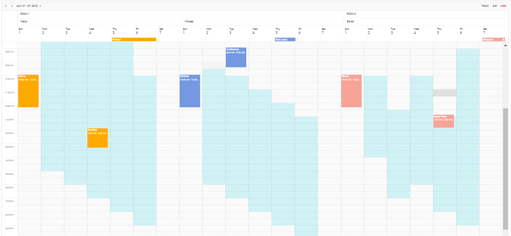

# Syncfusion React Scheduler How to setup different work hours for every work day of each resources

A quick start project that help you to create the Syncfusion React Scheduler with different work hours for event work days of each resources with minimal code.



## Scheduler features covered in this Project

This is a React project created using [Node](https://www.npmjs.com/package/node/v/8.16.0) 8.16.0. The Scheduler features included in this project as follows.
* Resource grouping and setting different work hours to every work day of each resources with the help of actionComplete and dataBound event of the Scheduler.
* React Scheduler displaying basic view with appointments.
* Drag and resize action enabled for evnets by default.

## How to run this application?
To run this application, you need to first clone the `ej2-react-scheduler-resource-different-work-hours` repository and then navigate to its appropriate path where it has been located in your system.

To do so, open the command prompt and run the below commands one after the other.

```
git clone https://github.com/SyncfusionSamples/ej2-react-scheduler-resource-different-work-hours react-different-work-hours
cd react-different-work-hours
```

## Installing
Once done with downloading, next you need to install the necessary packages required to run this application locally. The `npm install` command will install all the needed packages into your current project and to do so, run the below command.

```
npm install
```
## Running on development server
Run `npm start` for a dev server. Navigate to `http://localhost:3000/`. The app will automatically reload if you change any of the source files.