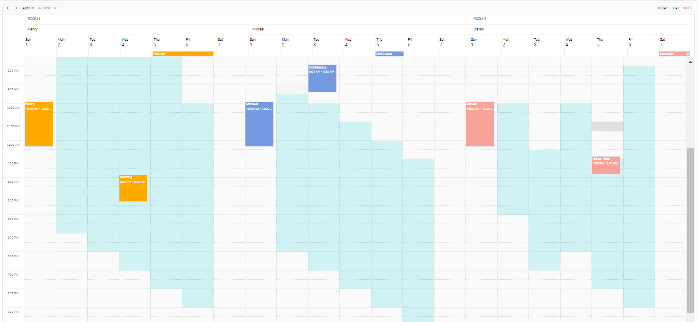

# Syncfusion React Scheduler How to setup different work hours for every work day of each resources

## Repository Description

This is a quick start React project demonstrating how to configure the Syncfusion React Scheduler component with different work hours for each resource across different work days. The sample showcases resource grouping with customized work hours scheduling, allowing developers to implement complex scheduling scenarios with minimal code complexity.



## Overview

This repository provides a complete implementation guide for setting up resource-based scheduling with varying work hours per resource per day. It's particularly useful for applications requiring flexible scheduling systems such as employee shift management, service booking, or multi-resource calendar solutions.

## Features

* **Resource Grouping**: Organize and manage multiple resources within the Scheduler
* **Customizable Work Hours**: Set different work hours for every work day of each resource
* **Event Management**: Resource-specific event handling using actionComplete and dataBound events
* **Multiple Views**: React Scheduler displaying appointments across various scheduling views
* **Drag and Resize**: Full drag-and-drop and resize functionality enabled for events by default
* **Responsive Design**: Adapts to different screen sizes and devices

## Prerequisites

This is a React project created using [Node](https://www.npmjs.com/package/node/v/8.16.0) 8.16.0 and requires the following:
* Node.js 8.16.0 or higher
* npm (Node Package Manager)
* React 16.x or higher
* Basic knowledge of React and ES6 JavaScript

## Documentation

For comprehensive documentation and examples, refer to the Syncfusion React documentation:

* **React Introduction**: https://ej2.syncfusion.com/react/documentation/introduction
* **React Schedule Component**: https://ej2.syncfusion.com/react/documentation/schedule/getting-started

## How to run this application?
To run this application, you need to first clone the `ej2-react-scheduler-resource-different-work-hours` repository and then navigate to its appropriate path where it has been located in your system.

To do so, open the command prompt and run the below commands one after the other.

```
git clone https://github.com/SyncfusionSamples/ej2-react-scheduler-resource-different-work-hours react-different-work-hours
cd react-different-work-hours
```

## Installing
Once done with downloading, next you need to install the necessary packages required to run this application locally. The `npm install` command will install all the needed packages into your current project and to do so, run the below command.

```
npm install
```
## Running on development server
Run `npm start` for a dev server. Navigate to `http://localhost:3000/`. The app will automatically reload if you change any of the source files.